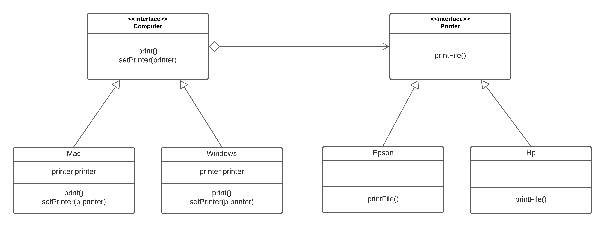

# Bridge Design Pattern Lab

## Directions

Say, you have two types of computers: Mac and Windows. Also, two types of printers: Epson and HP. Both computers and printers need to work with each other in any combination. The client doesn’t want to worry about the details of connecting printers to computers.

If we introduce new printers, we don’t want our code to grow exponentially. Instead of creating four structs for the 2\*2 combination, we create two hierarchies :

- Abstraction hierarchy: this will be our computers
- Implementation hierarchy: this will be our printers

These two hierarchies communicate with each other via a Bridge, where the Abstraction (computer) contains a reference to the Implementation (printer). Both the abstraction and implementation can be developed independently without affecting each other.

Expected output :

```
Print request for mac
Printing by a HP Printer

Print request for mac
Printing by a EPSON Printer

Print request for windows
Printing by a HP Printer

Print request for windows
Printing by a EPSON Printer
```

## UML Diagram

Your code must look like this :



## Tip

If you are stuck you can checkout the solution : `git checkout solution`
